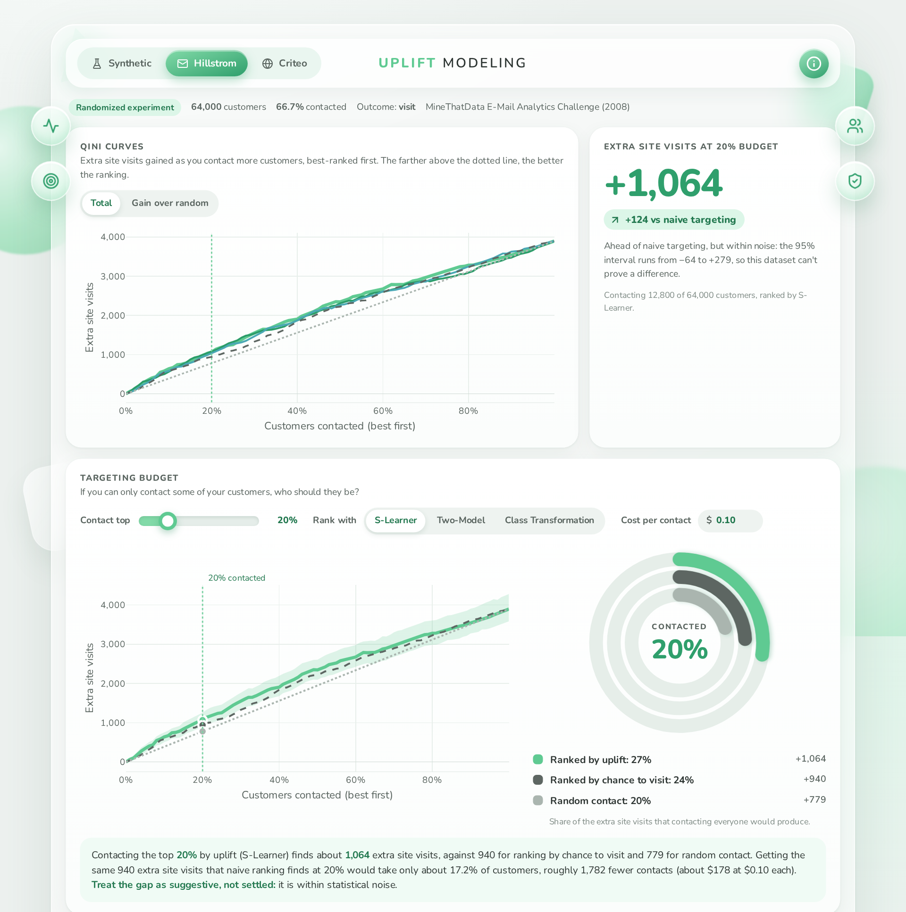

# Uplift modeling: who should actually get the intervention?

Ranking customers by *who will respond* is not the same as ranking them by *who will respond because they were contacted*. I tested whether the second is worth the effort on one simulated dataset and two real randomized experiments.

**Open `uplift_dashboard.html` in any browser.** It is one self-contained file: no server, no install.



## The finding

Uplift modeling pays off only when the customers most likely to act are not the ones the contact actually changes. The three datasets show three different cases.

| Dataset | Customers | Extra events from contacting the top 20% | | | Verdict |
|---|---|---|---|---|---|
| | | **By uplift** (3 estimators) | By chance to act (naive) | Random | |
| Simulated, truth known | 50,000 | 996 to 1,105 conversions | 96 | 200 | Clear win for uplift |
| Hillstrom e-mail test | 64,000 | 1,035 to 1,076 visits | 940 | 779 | Ahead by 10 to 14%, but within noise |
| Criteo ad test (10% sample) | 1,397,106 | 10,910 to 11,157 visits | 11,104 | 3,002 | No difference |

- **Simulated data.** The naive top 20% is 80% Sure Things (customers who act anyway), so it barely beats nothing. Uplift ranking finds close to the true value (about 1,080 to 1,190), which shows the pipeline recovers a known answer.
- **Hillstrom.** Uplift ranking is ahead, and matching the naive result would need about 16 to 18% of customers instead of 20%. But the 95% interval on the gap includes zero for all three estimators, so this is suggestive, not proven.
- **Criteo.** Ranking by uplift does no better than ranking by likelihood to visit. The interval on the gap includes zero, and the estimators pick 75 to 94% of the same customers as the naive model. What does matter is contacting a fraction at all: the top 20% by either method captures about 73 to 74% of all the extra visits that contacting everyone would produce, against 20% for random contact.

**What this means in practice:** contact roughly the best-ranked fifth, not everyone. Do not assume uplift modeling beats a good response model. On Criteo it did not, and on Hillstrom the evidence is not strong enough to say. The naive ranking on Criteo has a Qini AUC of 0.088 (interval 0.079 to 0.096), far above zero, so the customers most likely to visit are also, on the whole, the ones the ad moves most. That is why the two rankings coincide. I did not investigate why.

**Who is persuadable on Hillstrom (named features).** Customers who bought women's items respond about twice as strongly to the e-mail (+7.8 vs +4.0 percentage points). Men's-item buyers respond less (+5.2 vs +7.2). Recency, spend, channel, area type and new-customer status show no clear difference.

## What I did

- **Data:** the simulated set (hidden segments, known true uplift), Hillstrom (64,000 customers, e-mail vs no e-mail, outcome: site visit) and a 10% random sample of Criteo Uplift v2.1 (outcome: visit).
- **Estimators** from `scikit-uplift`: S-Learner, Two-Model and Class Transformation, plus a naive "will they act?" model that ignores the contact. All use the same shallow gradient-boosting learner.
- **Evaluation:** Qini AUC, AUUC and Uplift@k, the metrics built for this problem. Accuracy and F1 do not apply. Every customer is scored by models that never saw them (5-fold cross-fitting), and intervals come from bootstrap resampling.
- **Budget simulation:** extra events gained when only the top k% are contacted, ranked by each model versus random. The dashboard lets you move the budget and enter a cost per contact.

## Why the numbers can be trusted

- **Randomization.** In both real datasets, contact was assigned at random. Hillstrom: customer features cannot predict who was e-mailed (AUC 0.50, largest gap between groups 0.009 SD). Criteo: AUC 0.507, largest gap 0.049 SD on one feature. That is small and below the usual 0.1 warning level, but not zero.
- **Known truth.** On the simulated data the estimated gain can be compared with the true gain (see the dashboard's validation chart).
- **Published figures.** The Hillstrom file matches its published SHA-256 fingerprint, arm sizes (21,306 / 21,307 / 21,387), spend lifts ($0.77 men's, $0.42 women's) and purchase lift (+0.68 points).
- **No self-marking.** Scores are out-of-fold. My own curve calculation matches scikit-uplift's uplift curve exactly.

### Causal assumption

My claim is that, among customers with the same features, whether someone was contacted has nothing to do with how they would have behaved anyway. This is called unconfoundedness. Here it holds by design: in Hillstrom the e-mail went to customers chosen at random, and in Criteo the ad tests kept a random part of the audience out of the campaign. Contact was decided by chance, not by anything about the customer. That is why I read the gap between contacted and held-back customers as the effect of the contact, and why I do not adjust for other variables. I checked instead of just assuming it: a model could not tell who was contacted from customer features (AUC 0.50 on Hillstrom, 0.507 on Criteo). The Criteo gap is small but not exactly zero, so I treat randomization as holding, not as proven. I also assume one customer's contact does not change another customer's behavior.

## Limits

- **No ground truth on real data.** Nobody is both contacted and not contacted, so individual effects are never observed. Scores show how well a ranking sorts groups of customers.
- **Estimators can disagree.** On Hillstrom the three uplift estimators share only 53 to 68% of their top-20% audiences, so the choice of estimator matters. I report all of them, not only the best.
- **Hillstrom pools the two e-mail versions** (men's and women's) into one "e-mail" treatment. The outcome is site visits, not purchases, because purchases are rare (about 0.9%).
- **Criteo features are anonymized (f0 to f11).** The results show who to contact, not why.
- **Criteo uses a 10% sample, one outcome (visit) and one untuned learner.** Intervals use 30 bootstrap resamples (200 elsewhere) because of the size, so they are rough. Intervals reflect evaluation noise, not variation from retraining the models. A tuned or different learner could change the picture.
- **Effects are visits or conversions, not profit.** Neither dataset has contact costs, so the dashboard's cost per contact is your own assumption.
- **No uplift tree or forest.** `scikit-uplift` does not include one.

## Reproduce it

1. Install: `pip install -r requirements.txt`
2. Get the data (not included in this repo):
   - Hillstrom: the MineThatData E-Mail Analytics and Data Mining Challenge dataset. Save it as `data/hillstrom.csv`.
   - Criteo Uplift v2.1 (about 311 MB): https://ailab.criteo.com/criteo-uplift-prediction-dataset/ or https://huggingface.co/datasets/criteo/criteo-uplift. Keep it gzipped.
3. Run:
   ```
   python uplift_pipeline.py --datasets synthetic hillstrom --hillstrom-path data/hillstrom.csv
   python uplift_pipeline.py --datasets criteo --criteo-path criteo-research-uplift-v2.1.csv.gz --sample-frac 0.1
   python build_dashboard.py
   ```
   The Criteo run takes about 20 to 40 minutes. Each run adds to `results.json`, and `build_dashboard.py` rebuilds `uplift_dashboard.html` from it.

## Repo layout

```
uplift_dashboard.html     finished dashboard (open in a browser)
dashboard.png             screenshot shown at the top of this README
uplift_pipeline.py        fits the models, computes metrics, writes results.json
build_dashboard.py        builds the dashboard from results.json
dashboard_template.html   the dashboard's design (needed to rebuild)
results.json              every computed number behind the dashboard
requirements.txt
```

## Data and credits

- Hillstrom: Kevin Hillstrom, *MineThatData E-Mail Analytics and Data Mining Challenge* (2008).
- Criteo: Diemert, Betlei, Renaudin and Amini, *A Large Scale Benchmark for Uplift Modeling* (AdKDD 2018). Licensed CC BY-NC-SA 4.0 for non-commercial use, so it is not redistributed here.
- Models and metrics: `scikit-uplift`.
